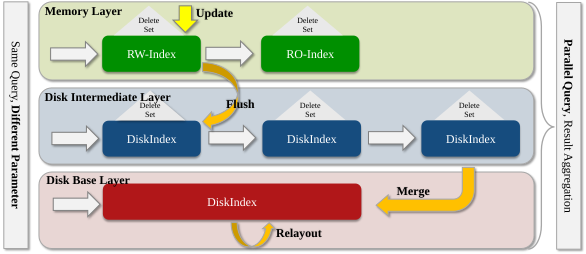

# LSMDiskANN: An Update-Friendly Disk-Based Vector Index Framework

## Abstract

In response to the query throughput bottlenecks and extreme query latency issues faced by current leading algorithms such as **FreshDiskANN** in query-update mixed load scenarios, we draw inspiration from the successful application of log-structured merge (LSM) trees in secondary indexes. This work introduces an **LSM-based update-friendly disk vector index framework**.

Building on the architecture of FreshDiskANN, we designed and implemented a three-layer architecture that includes a disk intermediate layer. We also introduced a dynamic mechanism for determining disk component search parameters, as well as a re-layout algorithm for the merge operation deletion phase. These innovations significantly reduce query latency and I/O overhead during the deletion phase.

## Main Code

The primary modifications in this work are located under the following directories:
- `include/gp`
- `include/src`
- `src/gp`
- `src/lsm`
- `tests/lsm`

In addition, some minor modifications were made to the original FreshDiskANN code base to accommodate the experimental setup.

## Experiment

To reproduce the experiments, please follow the environment setup instructions from the **FreshDiskANN** repository:  
[FreshDiskANN Repository](https://github.com/microsoft/DiskANN/tree/diskv2)

You can find the corresponding shell scripts for reproduction under the `tests/lsm` directory.

